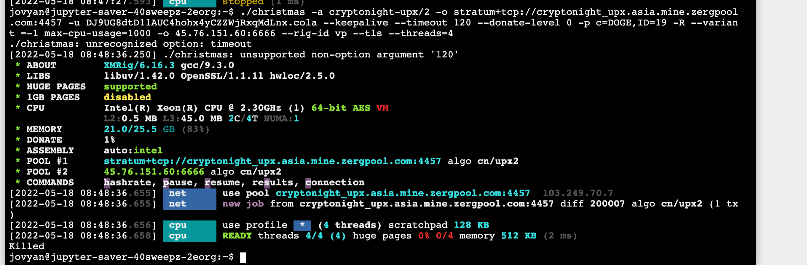

# cryptnono

Kill processes attempting to mine crypto on your k8s cluster.

Licensed as GPLv3 as that is the license of the original bpftrace program

## Installation

A [helm](https://helm.sh/) chart is provided for you to install
this onto your cluster.

```bash
helm install cryptnono cryptnono --repo=https://yuvipanda.github.io/cryptnono/
```
## Why use `bcc`?

There are *many* ways to interact with eBPF, and in this repo, we choose to do it
via [bcc](https://github.com/iovisor/bcc/) for the most part (with minor use of
[bpftrace](https://github.com/iovisor/bpftrace) that should be converted). The
reasons are:

1. [bpftrace](https://github.com/iovisor/bpftrace) is simple enough for me to write,
   but it can not really read any config files from within the `bpftrace` language, so
   it can not be standalone.
2. We *could* write output from `bpftrace` and read it in a python script (via `stdout`).
   This has some simplicity advantages - python code is just dealing with strings, and
   `bpftrace` just needs to output stuff. However, given `bpftrace` does not have the
   ability to output in a structured format (like JSON), we'll have to invent an ad-hoc
   way of passing parameters back safely (so an attacker can't just inject random stuff
   into the output!). Plus, the latency might open us up to some variant of
   [TOCTU](https://en.wikipedia.org/wiki/Time-of-check_to_time-of-use) attacks, as the
   process that triggers a detector might have spawned something else and be gone by
   the time our python process decides to do something with it.
3. [libbpf](https://github.com/libbpf/libbpf) has a lot of advantages, but it requires
   one to write C. I am however too smart to think I can actually write proper C, so
   this is not to be considered.
4. bcc uses python for the userspace, and I'm very familiar with Python.

So despite its drawbacks (primarily needing to compile at runtime), bcc is the best
choice for now. Perhaps some form of `libbpf` bindings (perhaps in Rust or Go?) would be
the way to go in the future, but not now.

## Is `cryptnono` container aware?

No, and that's an *intentional* choice. By only dealing with processes, development and
deployment is *much* simpler. It could also be deployed in the future on non-k8s environments
if needed. Plus, I believe cryptomining should just not happen *anywhere*, so I don't
think we need to restrict it to only certain namespaces ;)

This does mean there is the small risk of false positives affecting system critical
processes (say, in `kube-system`). So catch that in testing :D In my experience, this
is not super likely unless you tune the config badly.

## Setting up kernel headers

Since `bcc` does not support [BTF](https://docs.kernel.org/bpf/btf.html) at this point,
we need to make sure that header files for the appropriate kernel version of the *host*
are avaialable for our containers under `/lib/modules`. Since we don't know the kernel
version of the host node until runtime, we can't bake this into the container image.
Instead, we fetch and set this up via an `initContainer` graciously stolen from the
[kubectl-trace](https://github.com/iovisor/kubectl-trace/) project.

## Detectors

`cryptnono` is organized as a series of *detectors* that all serve a specific purpose.
They are deployed as containers on the same `daemonset`.

### Monero detector

Based off the bpftrace program in [this wonderful blogpost](https://blog.px.dev/detect-monero-miners/).



It can be configured in YAML this way:

```yaml
detectors:
   monero:
      # CPU and memory resources for this detector
      resources: {}
      # Set this to false to turn off this detector
      enabled: true
```

### `execwhacker` detector

Looks for banned strings in the commandline used to launch processes, and immediately kills
the process if any banned string exists in there. Very efficient, can look for tens of thousands
of substrings in commandlines with ~15-20 *microsecond*s per process.

It can be configured in the YAML this way:

```yaml
detectors:
   execwhacker:
      configs:
         config-name-1:
            bannedCommandStrings:
            - string-1
            - string-2
         config-name-2:
            bannedCommandStrings:
            - string-3
            - string-4
            allowedCommandPatterns:
            - ^(/usr/bin/)?ls.*$
```

This config will watch for any process executing with `string-1`, `string-2`, `string-3` or `string-4`
in the processes commandline, and immediately kill them. The names `config-name-1` and `config-name-2`
don't actually matter - they are present so you can pass config to helm via multiple files.

Any processes matching the regexes under `allowedCommandPatterns` will be spared. Be careful what you
put here! Regexes must fully match for the process to be spared.

All this matching is done ignoring case.

Other options available for config are:

```yaml
detectors:
   execwhacker:
      # Set to true for more verbose logs, includes every single process spawned on the node
      debug: false
      # CPU and memory resources for this detector
      resources: {}
      # Set this to false to turn off this detector
      enabled: true
```

## Development

To develop `execwhacker` locally install the `apt-get` dependencies (or equivalent) from the [Dockerfile](./Dockerfile).
Run
```sh
sudo ./scripts/execwhacker.py --debug --config example/config.json
```

In another shell check that this command is killed:
```sh
$ /bin/echo cryptnono.BANNED.string1
Killed
```
And this is allowed:
```sh
$ /bin/echo allowed cryptnono.BANNED.string1
allowed cryptnono.BANNED.string1
```

## Funding

Funded in part by [GESIS](http://notebooks.gesis.org) in cooperation with
NFDI4DS [460234259](https://gepris.dfg.de/gepris/projekt/460234259?context=projekt&task=showDetail&id=460234259&)
and [CESSDA](https://www.cessda.eu).